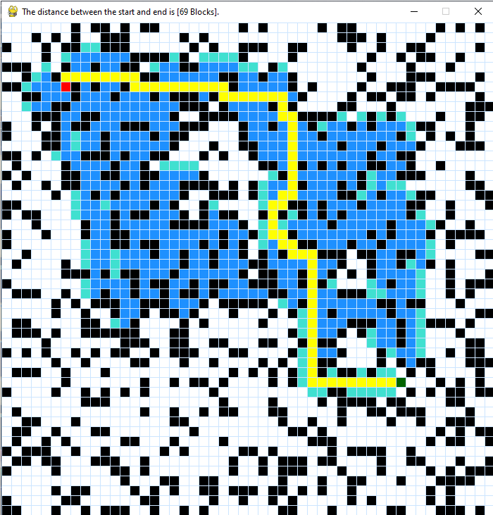

#                                                 💻 A* PathFinding Visualizer 💻

***

#### This project is a visualiztion tool for the A* algorithm. Follow the steps to run this project.

***

```
#1 git clone https://github.com/Mayur-Debu/A-PathFinder.git
#2 pip install -r requirements.txt
#3 python pathFinder.py
```

***
### Screenshot: 


***

### Details about the project:
<p>
  This project is a visualization tool for the A* algorithm. A* algorithm is a artificial intelligent path finding algorithm. It has prerequisite knowledge about the goal, and this project is the implementation of the same.
  
</p>

***

### Control's:

```
Red spot denotes 'start' node.
Green spot denotes 'end' node.
Black node denotes 'barrier' nodes.
Blue node denotes 'visited' nodes.
Turquoise node denoted 'open' nodes.

Mouse Control's:
Left Click: Selecting the start node, end node and the barrier's.
Right Click: Deselecting and reallocating the start node, end node and the barrier's.

Keyboard Control's:
R: Generate random barrier's.
C: Clear the Grid.
Space: Start and stop the visualization.

```

***

<p><a href="https://www.buymeacoffee.com/SmartMonkE"> </a></p>
